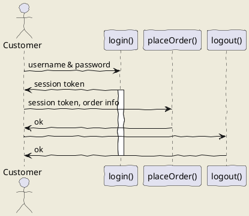
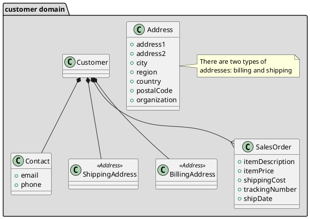
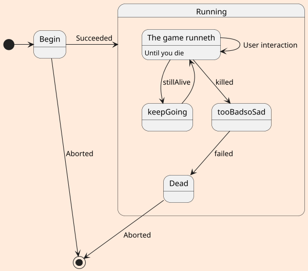

## uml: sequence diagram

Here I will embed PlantUML markup to generate a sequence diagram.

I can include as many plantuml segments as I want in my Markdown, and the diagrams can be of any type supported by PlantUML.

* la imagen generada por `plantUML`

* modificado la configuración de `plantUMl` 
  * `"plantuml.exportOutDir": static/diagramas/out"`

* mas ejemplos

### uml: class diagram

* otro

## uml: state diagram

* pero el problema es que solo se ve el resultado en el previo desde visual y no al renderizar la página
* mermaid.js creo que puede dar mejores resultados

# origen 

* en este [post de freeCodeCamp](https://www.freecodecamp.org/news/inserting-uml-in-markdown-using-vscode/)